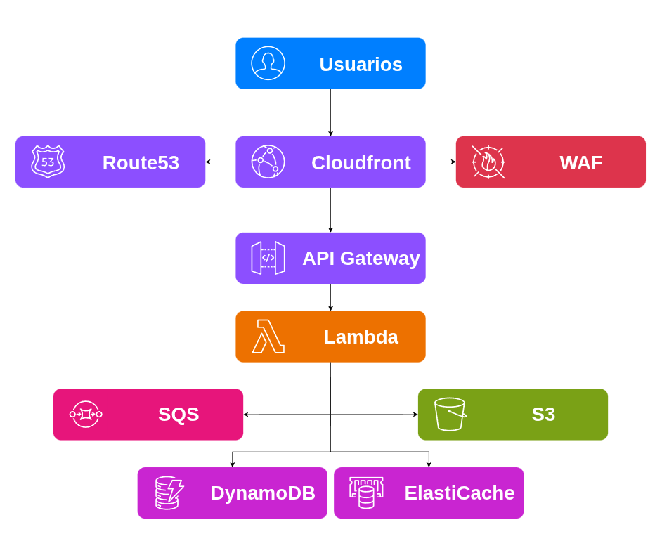
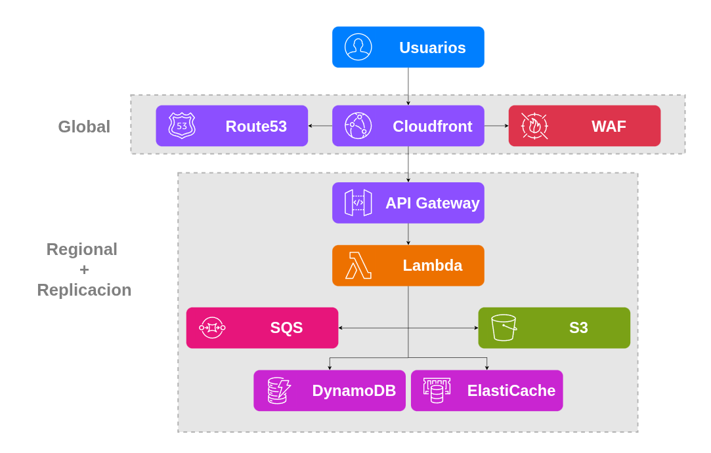
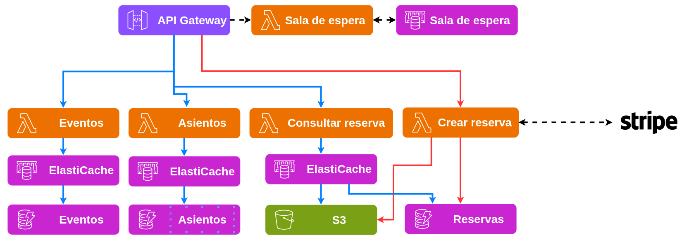
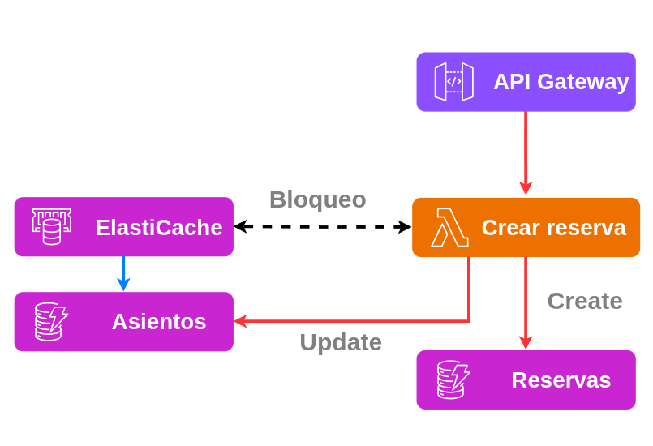
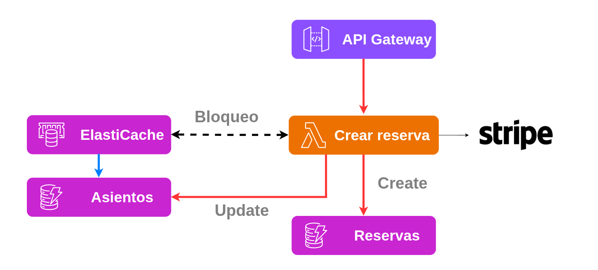
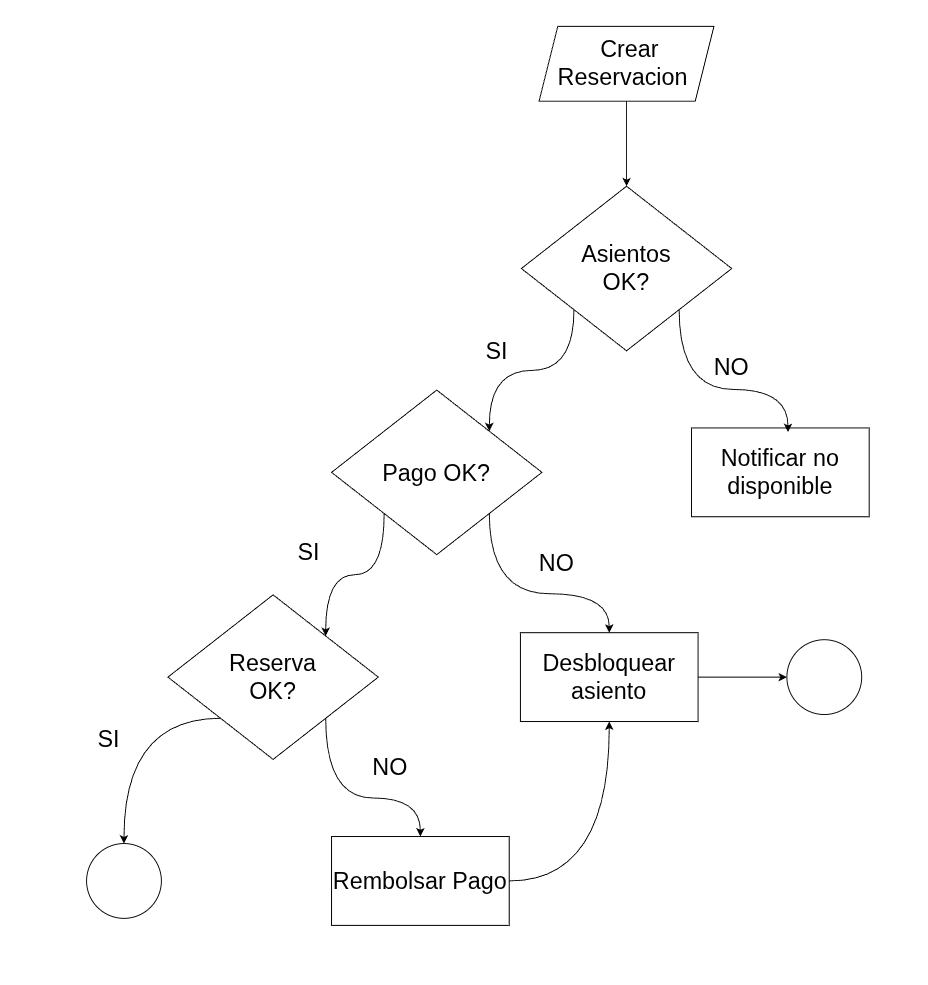

## Requerimientos
### Funcionales
- El usuario puede **consultar eventos** (Agregado por observación propia)
- El usuario puede **consultar asientos numerados** (Requerido por Challenge)
- El usuario puede **reservar asientos numerados** (Requerido por Challenge)
- El usuario puede **consultar reservación** (Agregado por observación propia)
### No funcionales (Challenge)
- El sistema debe priorizar baja latencia en la consulta y ser multi-región (4 países en 3 continentes distintos) - [Detalle](#multi-region-y-reducción-de-latencias)  
- El sistema debe escalar 10-20x en eventos populares - [Detalle](escalabilidad-ante-picos-de-demanda)
- El sistema debe ser consistente a la hora de reservar boletos - [Detalle](consistencia-en-reservas-de-asientos)
- El sistema debe conciliar el pago y la entrega del boleto de manera impecable - [Detalle](conciliación-de-pagos-y-entrega-de-boletos)
#### Adicionales
- El sistema debe ser manejable por un equipo de 5 personas - [Detalle](#stack-tecnológico-operable-por-5-Ingenieros)
- IaC - [Detalle](./02%20-%20Infraestructura%20como%20Código.md)
- Observabilidad - [Detalle](./03%20-%20Observabilidad.md)
## Diseño

### API

```
API
├── GET /eventos 
|   ├── [Lista de eventos]
├── GET /eventos/{id}/asientos
|   ├── [lista de asientos]
├── GET /reservas/:reservaid
|   ├── boletos archivo
└── POST /reservas
    └── Reserva
```

### Arquitectura

#### HLD

Lo que busco principalmente aquí es identificar la base de nuestro sistema a partir de los requerimientos funcionales. En esta etapa todavía no quiero definir ninguna tecnología ni intentar cubrir los requerimientos no funcionales.

Por ahora, no estoy considerando cosas como baja latencia, multi-región o escalabilidad. Quiero dejar esas decisiones para después, una vez que tenga más claro lo que necesita el sistema.


#### Stack tecnológico operable por 5 Ingenieros

La principal razón por la que elegí **AWS** es que el sistema debe ser **operado por un equipo de solo 5 Ingenieros**. Por eso, quiero mantener la **complejidad operacional lo más baja posible**.

Por la misma razón, voy a **priorizar servicios managed y serverless**. Esto tiene el trade-off de que los **costos de infraestructura podrían ser mayores**, pero a cambio puedo reducir la **carga de operación y mantenimiento**.

El trade-off de **no utilizar multi-cloud** es una mayor dependencia de AWS (vendor lock-in) y menos flexibilidad para mover las cargas de trabajo entre proveedores.

| Capa                  | Tecnología            | Justificación                                              |
| --------------------- | --------------------- | ---------------------------------------------------------- |
| **DNS**               | Route 53              | Routing inteligente por latencia                           |
| **WAF**               | AWS WAF               | Seguridad de las API                                       |
| **CDN**               | CloudFront            | Entrega global de estáticos                                |
| **API**               | API Gateway           | Rate limiting, throttling, autenticación                   |
| **Lógica de negocio** | Lambda                | Serverless, auto-escalable, reducción de administración    |
| **Datos**             | DynamoDB              | Escalable, latencia baja, transacciones atómicas           |
| **Caché (Locks)**     | ElastiCache Redis     | Distributed locks con TTL, real-time seat map, sorted sets |
| **Caché (Estática)**  | ElastiCache Memcached | Caché de eventos/venues (datos estáticos, solo lectura)    |



#### Multi-region y Reducción de latencias

Una estrategia multi-región (US, México, Mumba, Frankfurt) para optimizar las latencias, distribuyendo el tráfico de los usuarios hacia la región más cercana y apoyándome en componentes globales como Route 53, CloudFront y WAF.

Voy a replicar S3 y DynamoDB entre las regiones, mientras que ElastiCache operará de manera independiente en cada una.



#### Escalabilidad ante picos de demanda

Para este caso, parto de que los componentes que elegí en AWS ya ofrecen buenos tiempos de respuesta y una buena capacidad para manejar picos de demanda. Sin embargo, si esto no fuera suficiente, lo que buscaría para manejar estos picos sería implementar una sala de espera con Redis.

La idea sería generar una fila virtual para que las solicitudes no lleguen directamente a los servicios y así evitar saturarlos. El trade-off es que estaría agregando un servicio más que mantener y también un nuevo punto de fallo.



#### Consistencia en reservas de asientos

De igual manera que en la solución anterior, considero que DynamoDB ya ofrece una buena forma de mantener la consistencia en las escrituras y manejar la atomicidad que necesito.

Sin embargo, al tener múltiples réplicas de lectura y escritura en diferentes regiones, se vuelve más complicado que DynamoDB maneje por sí solo las colisiones o race conditions. Para resolver esto, quiero utilizar Redis para bloquear los asientos una vez que alguien los selecciona, definiendo una ventana de 10 minutos para completar la compra.

Si la compra se completa correctamente, actualizo la fuente de la verdad, que sería DynamoDB. Si no se completa dentro de la ventana, libero el asiento para que alguien más pueda tomarlo.



#### Conciliación de pagos y entrega de boletos

A nivel de componentes no cambiaría mucho. La forma en la que quiero asegurar que los pagos se procesen correctamente de inicio a fin es utilizando el patrón **Saga**, de esta manera puedo garantizar que la operación se complete correctamente y, en caso de que alguno de los componentes falle, revertir los cambios realizados.

El trade-off es que esto podría afectar la experiencia del usuario si el fallo ocurre al generar la reserva, ya que tendría que revertir los cambios y liberar el asiento. Para el usuario, esto significaría perder el lugar que había seleccionado.




## Fuera de Alcance (Por tiempo y no es requerido por Challenge)

- Administración de la plataforma (Panel de administración)
- Consultar información del usuario
- Filtrar eventos
- Vista en tiempo real con Web Socket
- Agregar más seguridad tanto en acciones operativas como en la aplicación(Solo agregué WAF que no es nada)
- Detalle de la autenticación y autorización
- Detalle de entidades
- Detalle de cómo es el proceso de compra con flujo (Diagramas de secuencia y flujo)
- Estimación de costos