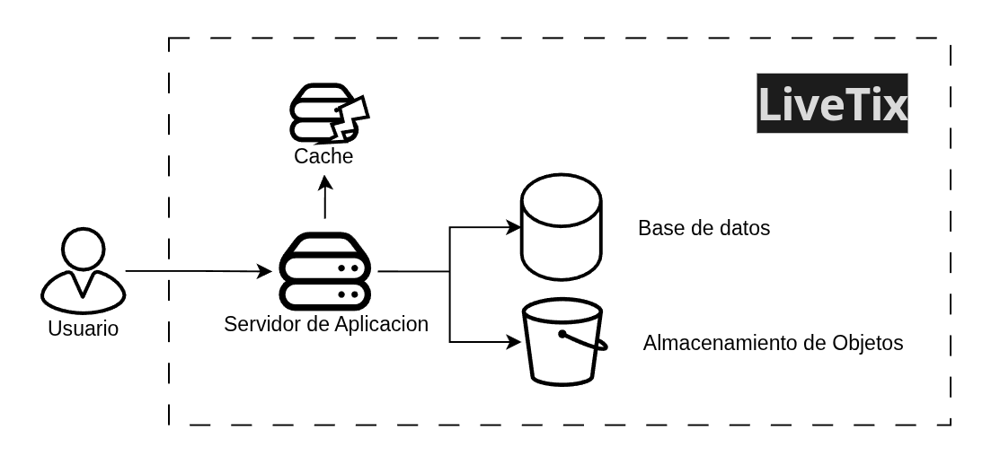

## Requerimientos
### Funcionales
- El usuario puede **consultar eventos** (Agregado por observacion propia)
- El usuario puede **consultar asientos numerados** (Requerido por Challenge)
- El usuario puede **reservar asientos numerados** (Requerido por Challenge)
- El usuario puede **consultar reservacion** (Agregado por observacion propia)

##### Fuera de Alcance (Por tiempo y no es requerido por Challenge)
- Administracion de la plataforma (Panel de administracion)
- Consultar informacion del usuario 
- Vista en tiempo real con Web Socket
### No funcionales (Challenge)
- El sistema debe priorizar baja latencia en la consulta y ser multi-region (4 paises en 3 continentes distintos) - [Detalle](#multi-region-y-reduccion-de-latencias)  
- El sisema debe escalar 10-20x en eventos populares
- El sistema debe ser consistente e idepotente a la hora de reservar boletos
- El sistema debe consiliar el pago y la entrega del boleto de manera impecable
- El sistema es mayormente de lectura que de escritura
#### Adicionales
- El sistema debe ser manejable por un equipo de 5 personas
## Diseño

### API

```
API
├── GET /eventos 
|   ├── [Lista de eventos]
├── GET /eventos/{id}/asientos
|   ├── [lista de asientos]
├── GET /reservas/:reservaid
|   ├── boletos archivo
└── POST /reservas
    └── Reserva
```

### Arquitectura

#### HLD

Lo que busco principalmente aquí es identificar la base de nuestro sistema a partir de los requerimientos funcionales. En esta etapa todavía no quiero definir ninguna tecnología ni intentar cubrir los requerimientos no funcionales.

Por ahora, no estoy considerando cosas como baja latencia, multi-región o escalabilidad. Quiero dejar esas decisiones para después, una vez que tenga más claro lo que necesita el sistema.



#### Stack tecnologico operable por 5 Ingenieros

La principal razón por la que elegí **AWS** es que el sistema debe ser **operado por un equipo de solo 5 Ingenieros**. Por eso, quiero mantener la **complejidad operacional lo más baja posible**.

Por la misma razón, voy a **priorizar servicios managed y serverless**. Esto tiene el trade-off de que los **costos de infraestructura podrían ser mayores**, pero a cambio puedo reducir la **carga de operación y mantenimiento**.

El trade-off de **no utilizar multi-cloud** es una mayor dependencia de AWS (vendor lock-in) y menos flexibilidad para mover las cargas de trabajo entre proveedores.

| Capa                  | Tecnología                     | Justificación                                              |
| --------------------- | ------------------------------ | ---------------------------------------------------------- |
| **DNS**               | Route 53                       | Routing inteligente por latencia                           |
| **CDN**               | CloudFront                     | Entrega global de estáticos                                |
| **API**               | API Gateway                    | Rate limiting, throttling, autenticación                   |
| **Lógica de negocio** | Lambda                         | Serverless, auto-escalable, reducción de administración    |
| **Datos**             | DynamoDB                       | Escalable, latencia baja, transacciones atómicas           |
| **Caché (Locks)**     | ElastiCache Redis              | Distributed locks con TTL, real-time seat map, sorted sets |
| **Caché (Estática)**  | ElastiCache Memcached          | Caché de eventos/venues (datos estáticos, solo lectura)    |
| **Cola de mensajes**  | SQS / EventBridge              | Absorción de picos, desacoplamiento                        |
| **Notificaciones**    | SNS / SES                      | Email, SMS, push notifications                             |
| **Monitoreo**         | CloudWatch + PagerDuty + X-Ray | Métricas, logs, tracing, alertas                           


#### Multi-region y Reduccion de latencias

Una estrategia multi-región para optimizar las latencias, distribuyendo el tráfico de los usuarios hacia la región más cercana y apoyándome en componentes globales como Route 53, CloudFront y WAF.

Voy a replicar S3 y DynamoDB entre las regiones, mientras que ElastiCache y SQS operarán de manera independiente en cada una.

